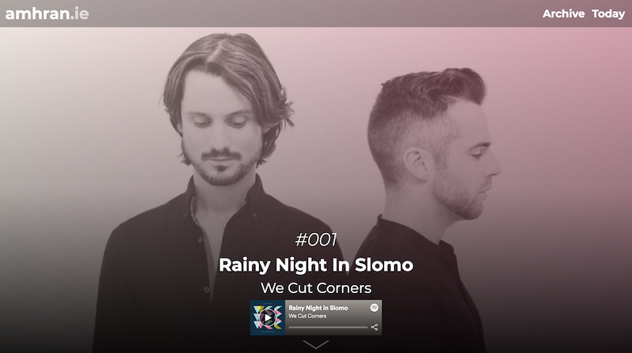
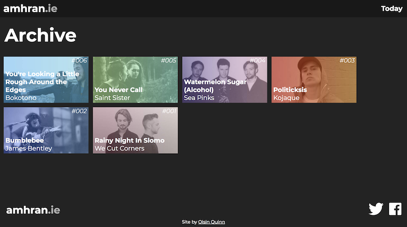

# Amhrán

Amhrán is a React-based website that showcases one Irish song every day/

I'm using react-router to have separate URLs for each track and archive.

The track info is imported from tracks.json, which kinda automates the whole process of adding tracks to the site.

## Development

You can run this on your own server with npm:

`npm install`

`npm start`

### Docker

There's a dockerfile for development:

`docker build -t amhran/app . `

`docker run -it -v ${PWD}:/usr/src/app -v /usr/src/app/node_modules -p 3000:3000 --rm amhran/app`

